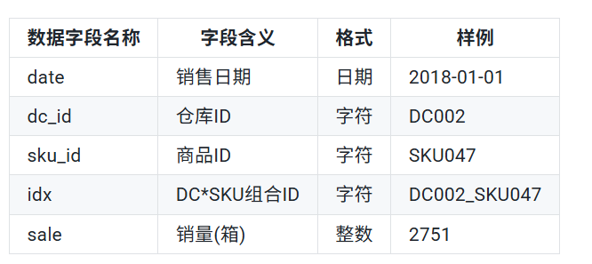
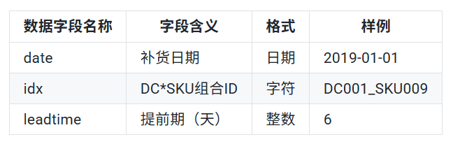
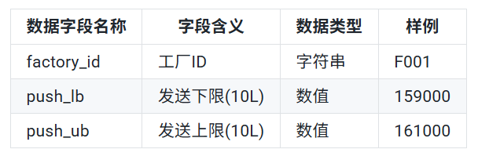
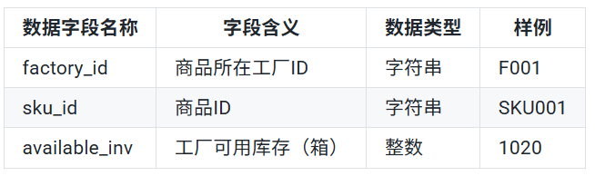
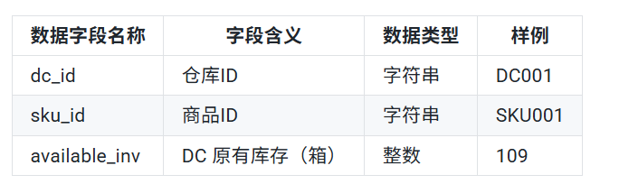
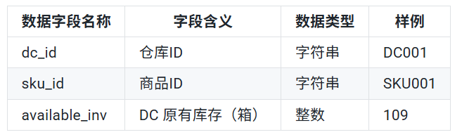
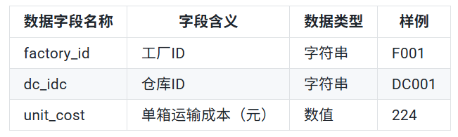
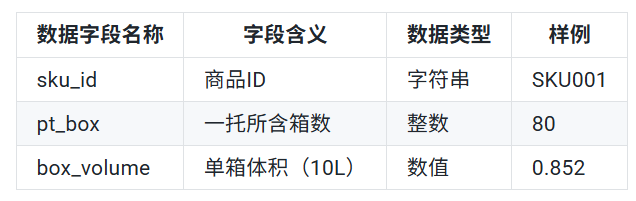

# 数据集
描述：X公司是一家大型饮料供应商，提供多种饮品从生产到配送的一体化业务。公司自建有生产工厂和DC仓库（Distribution Center，发运中心），通过公司管理的供应链网络，满足不同地区的产品需求。本次公开的数据来自于其一类产品在某地区的供应仓网结构和销售情况，公司在该地区有2个相应的生产工厂和18个DC仓库，销售77种不同细分子类商品。

## 历史销售数据

 ### 1.历史销售数据（sales_data.csv）

由72个SKU商品在18个DC仓库的销售数据构成。该数据集包含了从2018年1月1日到2020年7月30日每个DC*SKU组合的日销售信息，共有1080个不重复的DC∗SKU组合共83余万条记录。历史销售数据的字段含义及数据样例如下所示：

 ### 2.历史提前期数据（leadtime_data.csv）
 包含了1080个DC*SKU组合从2019年1月到2019年3月间补货提前期信息，共计96120条记录。历史提前期数据的字段含义及数据样例如下所示：
 

## 工厂数据
 ### 3.工厂发送上下限 （push_limit.csv）
 给出了工厂每日发货量的最小和最多发货量，其字段含义及数据样例如下所示：
 
 由于一些生产考虑，工厂的产线需要一直运行、不断生产，但工厂自身的库容存在容量限制，因此需要保证每天向外发运一定量以上的产品，以保证工厂不会爆仓。同时，要将产品从工厂发到DC，首先需要工厂里的工作人员将产品从工厂仓库中拣出来，装运到卡车上，再通过承运商运到DC（每个工厂有各自负责运输的承运商）。工作人员的拣货能力、装运能力，以及承运商的车队资源都是有限的，因此每个工厂每日的发货量存在上限。

 ### 4.工厂原有库存 （factory _inventory.csv）

 给出了两个工厂中各个SKU的起始库存，其字段含义及数据样例如下所示：
 

    
## DC数据

### 5.DC可用容量(dc_capacity.csv)
给出了各个DC的仓储容量上限，其字段含义及数据样例如下所示：

DC每天完成补货并满足下游客户的需求后，仓库内的剩余产品容量不能超过DC库容，否则DC无法储存产品。在旺季时，DC可能会出现爆仓现象，即产品总体需求大大超出了仓储限制，此时，DC需要考虑如何在不同的SKU之间分配有限的库容容量。

### 6.DC原有库存(dc_inventory.csv)
记录了每个DC种各SKU的起始库存量，其字段含义及数据样例如下所示：

## 运输数据

### 7.单箱运输费用 （transport_tariff.csv）
给出了从两个工厂到各个DC的单箱运输费用，其字段含义及数据样例如下所示：

运输成本是公司补货中的主要成本，每个DC都可以从任何一个工厂补货，但是由于距离远近，不同工厂到DC会有成本差距。很显然，DC希望尽量能够从运输成本更低的工厂补货，除非是优先工厂库存不足，再考虑从非优先工厂补货。

### 8.转化率(unit_rate.csv)
给出了产品运输过程种不同计量单位的转换率，即箱、托和升之间的关系，其字段含义及数据样例如下所示：

工厂内产品生产和原始储存是以升为单元，而DC进行储藏和销售时，则往往会选择箱作为计量单位；从拣货和运输的角度来看，则是按照托盘来操作更加方便。在这个过程中，便涉及到各个产品在不同计量之间的转换。需要注意的是，工厂要求DC补货的最小单元是托，不同饮料一托的瓶数会有所不同，DC进行补货时必须进行整托补货，这对于DC补货决策也进一步做出了限制。